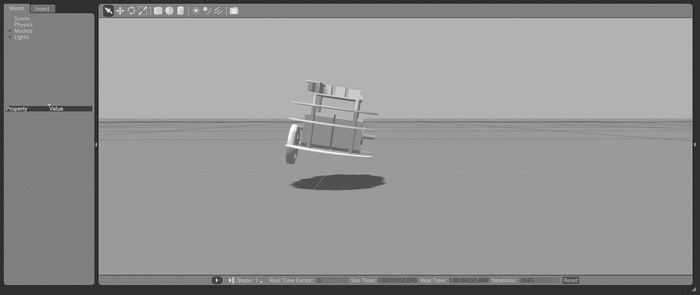
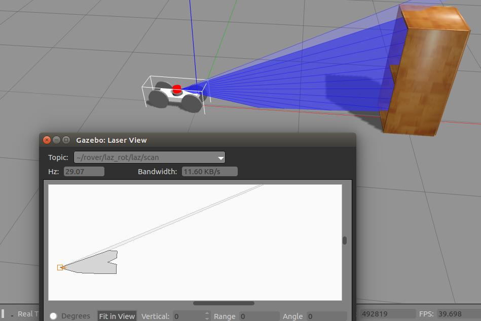
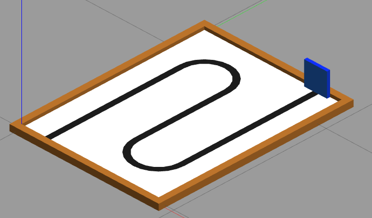

# O que é o Gazebo?

Até agora você ouviu sobre o que é e por que usar a ferramenta ROS. Durante essas leituras, você deve ter ouvido falar de "simuladores" que são utilizados em conjunto com o ROS. Porém, o que é um simulador?
Nesta seção, aprenderemos um pouco mais sobre o **Gazebo**, o simulador incorporado ao ROS que será utilizado durante as próximas aulas.

{: .d-block .mx-auto}

## O que são simuladores

Durante o desenvolvimento de projetos, é importante saber como ele irá se comportar em determinados ambientes. Neste contexto, os simuladores tornam essa tarefa possível: eles permitem que você adicione constantes que controlam as condições do ambiente e faz os cálculos de física necessários. Isso inclui comportamentos como a gravidade puxando um carrinho até o chão, os contatos entre as rodas e a calçada e o torque aplicado nas rodas.

{: .d-block .mx-auto}

Além disso, os simuladores suportam diversos sensores, como câmeras coloridas e de profundidade, IMU e GPS, que permitem que seu projeto interaja com o ambiente.

{: .d-block .mx-auto}

Com todas essas funcionalidades que as simulações proporcionam, o projeto final terá um comportamento próximo do desejado quando for colocado no ambiente real. Além de saber isso sem precisar construí-lo de fato (manufaturar e etc.), os resultados geralmente tem uma acurácia boa em comparação a modelos analíticos, e ajudam a encontrar comportamentos inesperados do sistema, além de facilitar análise e diversos tipos de testes. Tudo isso ajuda na redução de custos também, o que é muito importante em qualquer projeto.

## O Gazebo

Ao utilizar o ROS para projetar robôs, também é possível utilizar simuladores que estão integrados a esse sistema. Uma dessas ferramentas é o Gazebo, que será utilizado e aprofundado durante o andamento deste curso.

O Gazebo é um simulador que tem como principais ferramentas:

- A capacidade de criar simulações dinâmicas;
- Gráficos 3D avançados;
- Sensores com ruído;
- Uma variedade de *plugins* (para ver mais sobre o que são plugins, [clique aqui](http://gazebosim.org/tutorials?tut=ros_gzplugins));
- Modelos de robôs pré-prontos;
- A capacidade de executar o Gazebo em servidores remotos;
- Simulação em nuvem, utilizando ferramentas como o *AWS Robotics* e o *Gzweb*;
- Ferramentas de linha de comando.

## Componentes básicos do Gazebo

As simulações feitas em Gazebo necessitam de alguns componentes para que possam ser executadas corretamente. Nesta seção, iremos entender um pouco mais o que é cada um desses componentes e entender sua utilidade.

### Arquivos de mundo

Um dos componentes mais vitais de uma simulação é o ambiente de testes. Os **arquivos de mundo** são escritos em [**XML**](https://www.w3schools.com/xml/) e contém as informações do ambiente de testes, como o modelo do mundo e o tipo de vista que a câmera nos proporcionará.

No projeto desenvolvido neste curso, o **modelo do mundo** é a pista com linhas curvas.

{: .d-block .mx-auto}

### Arquivos URDF

O *Universal Robot Description Format*, ou formato de descrição universal de robô, é um tipo de arquivo responsável por processar o modelo do robô, juntando em seus arquivos características como os modelos, as juntas, as formas e as características físicas do robô. Estes arquivos também são escritos em *XML*.

Para mais informações sobre como funcionam os arquivos URDF, sugiro dar uma olhada na documentação oficial do ROS disponível [**nesse link**](http://wiki.ros.org/urdf).

### Arquivos de modelo

Como citado acima, para gerar a aparência do carrinho e da pista são necessários arquivos de modelo. Esses arquivos são extremamente importantes para que tarefas como geração de mundos e de componentes do carrinhos sejam facilitadas. Esses arquivos seguem o formato SDFormat - *Simulation Description Format*, que tem uma documentação disponível [**neste link**](http://sdformat.org/). Para saber mais sobre a implementação de arquivos de modelo, sugiro ver a documentação disponível [**neste link**](http://gazebosim.org/tutorials?tut=model_structure).

### Arquivos *launch*

Os arquivos de *launch* vão juntar tudo acima em apenas um arquivo para que sejamos capazes de abrir a simulação. Dentro do arquivo de *launch*, implementamos os *nodes*, o modelo do carrinho, da pista e os controles necessários para mover o carrinho. Para saber mais sobre arquivos de *launch*, sugiro dar uma olhada [**nesse link**](http://wiki.ros.org/roslaunch/XML).

## Abrindo uma simulação no Gazebo

Agora que você já entendeu um pouco mais sobre como funcionam os arquivos que gerarão a simulação, vamos ver como isso funciona na prática.
Como dito anteriormente, quem junta tudo em um lugar só é o arquivo de *launch*, e é ele que chamaremos para iniciar nossa simulação.

O comando utilizado para abrir uma simulação é:

``` ROS
roslaunch modelo_carrinho gazebo.launch
```

Vamos entender cada parte do comando?

- O *roslaunch*:

Ele é o comando responsável por executar os arquivos de *launch*. Sua principal função é ser uma ferramenta que inicia e pausa os *nodes* do ROS.

- *modelo_carrinho*:

Aqui, você está se referindo ao nome do pacote. Falamos um pouco sobre pacotes no no guida de instalação do ROS e você pode ler mais sobre pacotes no contexto de ROS [**neste link**](http://wiki.ros.org/Packages). Em resumo, um software do ROS é organizado em pacotes, e cada pacote contém *nodes*, livrarias e softwares externos.

- *gazebo.launch*:

Aqui, você está se referindo ao arquivo de *launch* que irá gerar o mundo.

___

Ainda tem dúvidas sobre como as simulações do Gazebo funcionam? Dê uma olhada nas documentações oficiais do ROS e do Gazebo:

- [Tutoriais de Gazebo](http://gazebosim.org/tutorials)
- [Documentação ROS](http://wiki.ros.org/)

E caso tenha mais dúvidas, não hesite em contatar os monitores da matéria!
