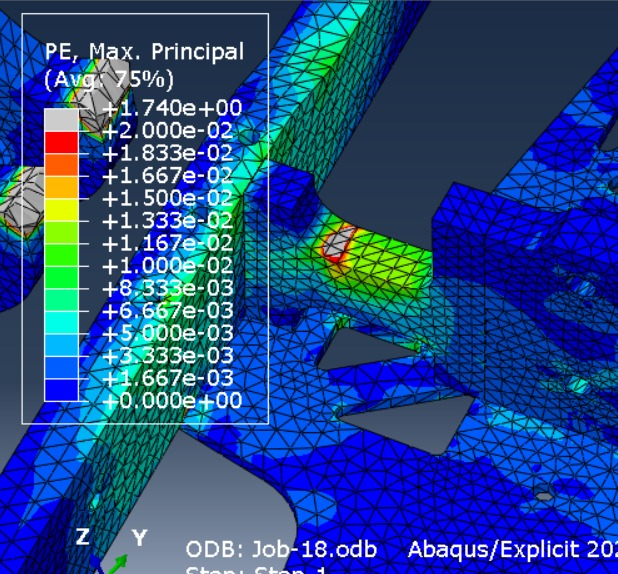

# Por que usar ferramentas de simulação?

Existem diversos tipos de simulação, seja na engenharia mecânica, elétrica ou até mesmo no setor financeiro, mas todas têm algo em comum: a possibilidade de realizar testes prévios de modo virtual antes do projeto real ser feito. Simulações virtuais são uma ferramenta extremamente poderosa, pois permitem a tomada de decisões e mudanças no projeto antes que recursos sejam gastos com a fabricação de um protótipo. Por exemplo, é mais barato realizar uma alteração de projeto em uma hélice de usina eólica durante a fase de simulação do que após sua fabricação.

No campo da engenharia mecânica, programas do tipo CAE (Computer-aided engineering) (e.g. Abaqus e Ansys), são muito utilizados para analisar diferentes características de uma peça em regime de trabalho, como o estresse, a deformação, a transferência de calor ou mesmo a distribuição do campo magnético.

Tomando a imagem a seguir como exemplo, é possível ver os níveis de deformação plástica de uma peça mediante impacto. Os resultados são destacados pela cor, sendo que a parte cinza possui maior chance de quebrar e as partes azuis representam as regiões menos afetadas. Dessa forma, podemos analisar qual o comportamento esperado para a peça antes mesmo que ela seja fabricada, de modo que podemos reforçar regiões mais afetadas ou retirar material das partes submetidas a menor esforço.

No contexto do nosso projeto de seguidor de linha, o uso de simulação permite validar diversas escolhas de projeto ainda em fases inicias, tais como "as dimensões do carrinho são adequadas?" ou "a quantidade de sensores é adequada?", de modo que é possível adaptar o desenho em CAD (Computer-aided design) antes mesmo de qualquer esforço em termos de fabricação do carrinho.

Como nem tudo são flores, o bom uso de um software de simulação exige grande discernimento da pessoa que o utiliza. O computador não sabe distinguir entre entradas absurdas de razoáveis e para qualquer entrada ele irá produzir uma resposta. É trabalho da engenheira ou do engenheiro responsável analisar de modo crítico os dados que entram e saem da simulação. Aqui, aplica-se o mesmo princípio vigente em estatística "entra lixo, sai lixo".

> A ferramenta de simulação numérica torna excelente o bom engenheiro, mas torna perigoso o mal engenheiro.

Se mal aplicada, uma simulação pode fornecer uma falsa sensação de segurança ao profissional descuidado e levar a falhas de projeto catastróficas. A todo momento é importante se questionar "O resultado da simulação é condizente com a teoria?" ou "O resultado da simulação é condizente com resultados anteriores?", de modo que a simulação não acabe com a necessidade do domínio metodológico da teoria dos processos envolvidos.

## Simulação na robótica

No campo de desenvolvimento de software, o uso de simulações possuem algumas vantagens específicas além das citadas até aqui. Em projetos de engenharia, usualmente o software é desenvolvido ao mesmo tempo que o hardware, de modo que testes completos do algoritmo de controle só podem ser realizados na fase final do projeto, quando o hardware já está próximo da versão final. Por meio do uso de simulações, é possível testar o software de controle com as mesmas entradas que seriam produzidas em um ambiente real com o hardware do robô, de modo que é possível encontrar problemas e solucioná-los com maior antecedência.

Outra vantagem proporcionada pela simulação é o isolamento de componentes do projeto. Ao testar um robô no mundo físico, existem diversos pontos de falha dentro do projeto. Desde rodas derrapando, interferência nos sensores ou mesmo uma bateria descarregada, problemas que podem custar preciosas horas de teste para serem identificados e solucionados. Dentro da simulação, temos um modelo simplificado e idealizado do mundo e do robô, de modo que temos um conjunto mais restrito de componentes que podem falhar. Podemos então testar o software do nosso robô em um ambiente controlado, de modo a focar em seu aperfeiçoamento.
