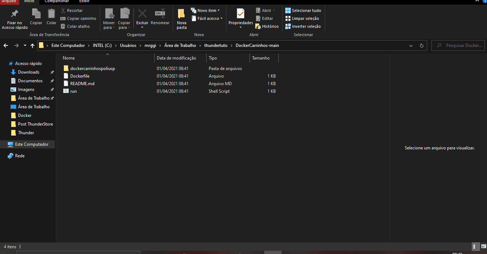

# Como executar o projeto em Docker

Além das opções previamente exploradas sobre como executar seus projetos com o WSL e com o Ubuntu, agora iremos conhecer uma terceira ferramenta: o Docker. Esta ferramenta consiste basicamente em uma espécie de máquina virtual que contém todos os *softwares* necessários para que você execute seu projeto.

Antes de tudo, verifique se o Docker está aberto. Para isso, abra o aplicativo do Docker no seu computador e veja se a seguinte tela está aparecendo:


Caso esteja desse jeito, é só seguir o tutorial!

## Como configurar o Docker para rodar seu projeto

Primeiramente, é necessário fazer o *download* do *Dockerfile*. Este arquivo será o responsável por conter as dependências do seu projeto. O arquivo pode ser baixado por meio **[deste link](https://github.com/ThundeRatz/DockerCarrinhos)**.

Após fazer o *download* deste arquivo, abra o **prompt de comando**/*command prompt* e redirecione para a pasta que o arquivo está. O modo mais fácil de fazer isso é copiando o caminho do arquivo e digitando no prompt de comando:

```
cd [caminho do arquivo]
```



Após isso, execute o comando abaixo para iniciar o seu projeto no Docker.

```
docker-compose up
```


Agora, para ver a simulação do seu projeto, basta abrir seu **navegador** e digitar na barra de URL:

```
http://localhost:8080/
```

Pronto! A simulação do seu projeto foi executada com sucesso utilizando o Docker.


Ao terminar, não esqueça de executar o comando:

```
docker-compose down
```

___

Caso os resultados sejam diferentes do tutorial ou existam dúvidas, não hesite em contatar um dos monitores da matéria!
