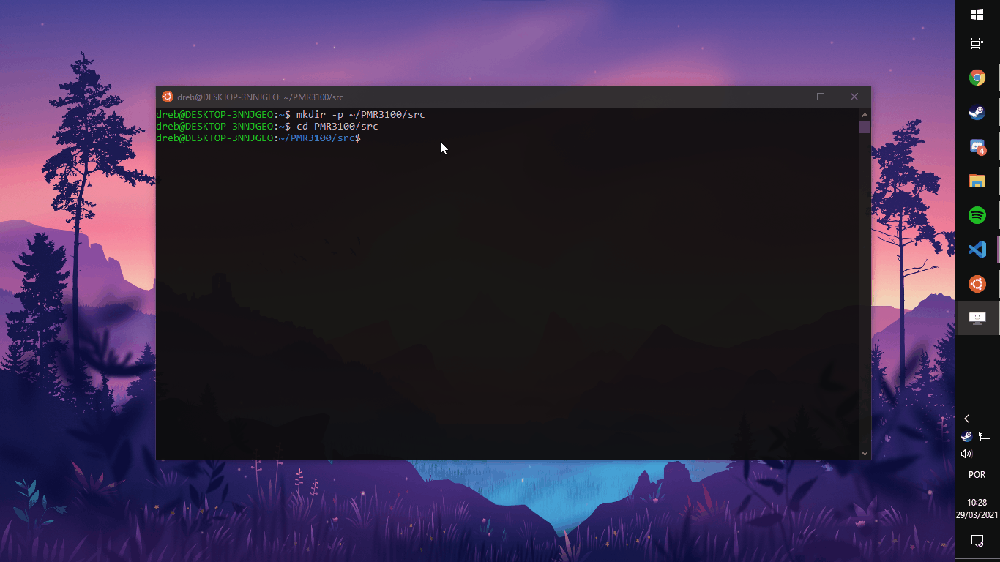

# Rodando o projeto no WSL!


Olá alunos!

Agora que vocês tem WSL, ROS, Gazebo e XServer devidamente instalado nos seus computadores chegamos a parte mais legal de todas, rodar o projeto! Para isso precisamos fazer uma pasta para conter os devidos arquivos. Primeiramente, certifique-se que seu servidor de XServer está rodando. Caso contrário, não teremos a janela do Gazebo aparecendo na nossa tela. Tudo certo? Então abra seu WSL e rode os seguintes comandos para criar o diretório do projeto e entrar nele.

```bash
mkdir -p ~/PMR3100/src
cd PMR3100/src
```


Esse primeiro comando cria a pasta ```/PMR3100/``` e dentro dela cria também a pasta ```/src/```. Já o segundo, te leva para a pasta recém criada. Se acostume a ver esse ```cd``` já que ele será frequentemente usado nesse guia para navegar entre os diretórios usando o linha de comando. Como pode ver pelo ```~/PMR3100/src$``` em azul, estamos na pasta ```/src/```.

Caso você tenha percebido, temos uma pasta com um nome mais genérico dentro de uma com o código da disciplina. É nessa pasta genérica onde os arquivos do projeto ficarão, enquando que vamos usar o diretório da disciplina para conter os arquivos de contrução. Pode soar meio confuso mas eventualmente, durante o restante do tutorial, tudo vai ficar mais simples. 

Agora que temos as pastas precisamos dos arquivos. Certifique-se que você se encontra no ```/src/``` e rode o seguinte comando:

```bash
git clone https://github.com/ThundeRatz/gazebo_modelo_carrinho.git
```




O que acabou de acontecer? Bom, você acabou de usar o **git** para copiar um repositório que se encontra no **GitHub**, igual ao lugar onde você está lendo esse tutorial. Basicamente, é um site que armazena códigos para ficar fácil de grupos grandes ou pequenos de pessoas trabalharem no mesmo programa. Se você tem interesse em saber mais, converse com um dos professores ou monitores da disciplina! O que você copiou foi o modelo do carrinho, que se encontra [nesse link aqui](https://github.com/ThundeRatz/gazebo_modelo_carrinho.git).

Agora que você tem os arquivos chegamos em uma parte que pode dar problema, instalar ainda mais coisas. O projeto em si tem algumas dependencias especificas que ainda não se econtram no seu computador. Para baixar elas, rode o comando a seguir:

```bash
sudo apt install ros-noetic-velocity-controllers python-pygame
```

Para rodar o comando você vai ter que fornecer a seu senha já que fazem uso do ```sudo```. 


Agora, volte para a pasta ```/PMR3100/``` usando o comando
```bash
cd ..
```
e finalmente execute o
```bash
catkin_make
```


O que isso vai fazer é construir o ambiente do projeto, usando como base aquilo que você baixou do **GitHub**. Deve demorar um pouquinho mas não se assuste. Apenas fique na paz e no aguardo. Assim que terminar rode o comando a seguir:


```bash
source devel/setup.bash
```

E pronto, agora você só precisa usar o comando

```bash
roslaunch modelo_carrinho gazebo.launch
```

que o Gazebo deve abrir na sua tela juntamente com o lindo carrinho da disciplina.


Sempre que você fechar o terminal do WSL e voltar você terá que executar o ```source ~/devel/setup.bash``` dentro da pasta ```/PMR3100/```. Caso contrário, você encontrará um erro ao tentar rodar o projeto.

E é isso. Agora você já sabe rodar o projeto direto do WSL. Se tiver aocntecido algum problema durante o tutorial entre em contato com algum dos monitores que eles estão mais do que felizes em ajudar.

Daqui pra frente é programar o carrinho ele, se divirta e que a diciplina seja um sucesso!
