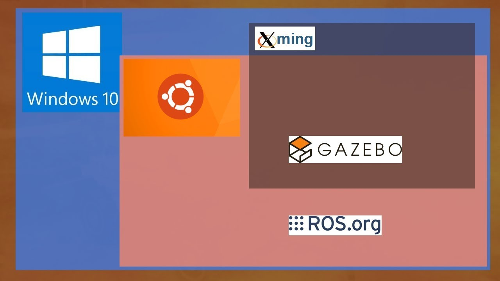
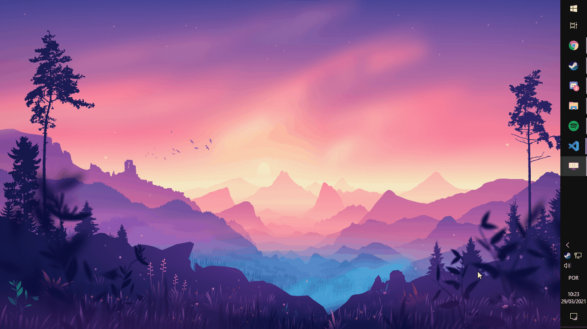
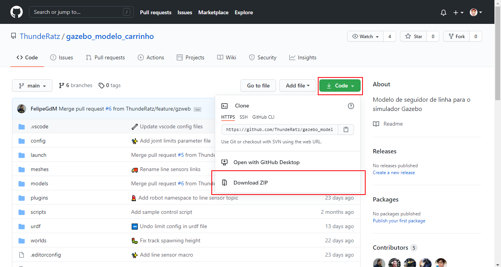
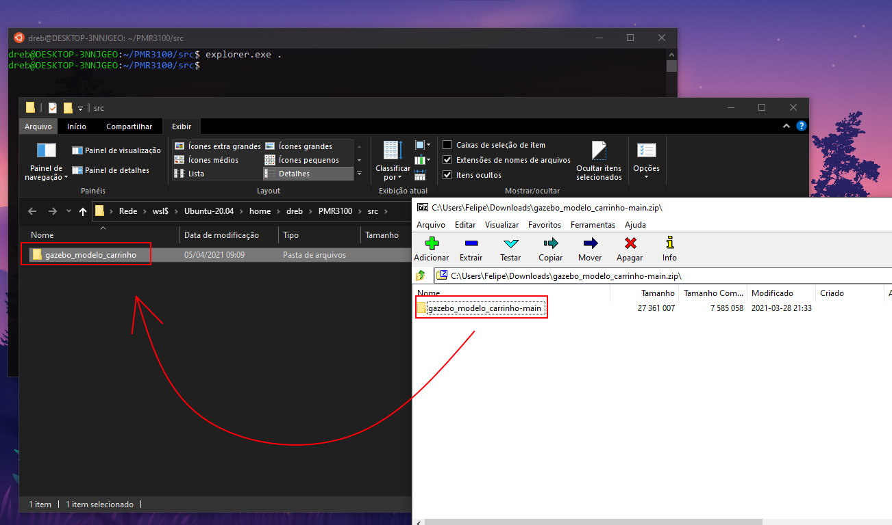
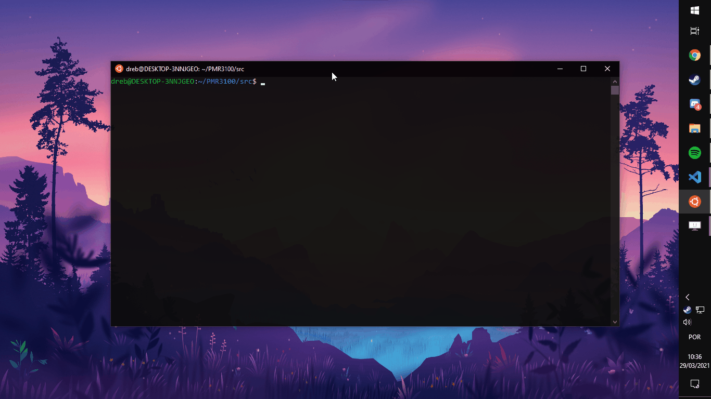

# Rodando o projeto no WSL!



Olá alunos!

Agora que vocês tem WSL, ROS, Gazebo e X Server devidamente instalados nos seus computadores chegamos a parte mais legal de todas, rodar o projeto! Para isso precisamos fazer uma pasta para conter os devidos arquivos. Primeiramente, certifique-se que seu servidor de display (X Server) está rodando. Caso contrário, não teremos a janela do Gazebo aparecendo na nossa tela. Tudo certo? Então abra seu WSL e rode os seguintes comandos para criar o diretório do projeto e entrar nele.

```bash
mkdir -p ~/PMR3100/src
cd PMR3100/src
```



Esse primeiro comando cria a pasta ```PMR3100``` e dentro dela cria também a pasta ```src```. Já o segundo, te leva para a pasta recém criada. Se acostume a ver esse ```cd``` já que ele será frequentemente usado nesse guia para navegar entre os diretórios usando a linha de comando. Como pode ver pelo ```~/PMR3100/src$``` em azul, estamos na pasta ```src```.

Caso você tenha percebido, temos uma pasta com um nome mais genérico dentro de uma com o código da disciplina. É nessa pasta genérica onde os arquivos do projeto ficarão, enquanto que vamos usar o diretório da disciplina para conter os arquivos de construção. Pode soar meio confuso mas eventualmente, durante o restante do tutorial, tudo vai ficar mais simples.

Agora que temos as pastas, precisamos dos arquivos. Certifique-se que você se encontra no ```src``` e rode o seguinte comando:

```bash
explorer.exe .
```

Isto vai abrir uma janela do explorador de arquivos do Windows dentro da pasta ```src```. Aqui, vamos colocar uma pasta com os arquivos do projeto. Essa pasta deve ser baixada como zip no [repositório do projeto](https://github.com/ThundeRatz/gazebo_modelo_carrinho). Abra a página, encontre o botão verde escrito **Code** e selecione a opção **Download ZIP**.



Com o ZIP em mãos, abra ele e transfira a pasta ```gazebo_modelo_carrinho-main``` para a pasta ```src```. Por fim, renomeie a pasta ```gazebo_modelo_carrinho-main``` para ```gazebo_modelo_carrinho```.



Agora que você tem os arquivos, chegamos em uma parte que pode dar problema, instalar ainda mais recursos. O projeto em si tem algumas dependências específicas que ainda não se encontram no seu computador. Para baixá-las, rode o comando a seguir:

```bash
sudo apt install ros-noetic-velocity-controllers python3-pygame
```

Para rodar o comando você vai ter que fornecer a sua senha já que faz uso do ```sudo```.


Agora, volte para a pasta ```PMR3100``` usando o comando:

```bash
cd ..
```

E finalmente execute o:

```bash
catkin_make
```



O que isso vai fazer é construir o ambiente do projeto, usando como base aquilo que você baixou do **GitHub**. Deve demorar um pouquinho, mas não se assuste. Apenas fique na paz e no aguardo. Assim que terminar, rode o comando a seguir:

```bash
source devel/setup.bash
```

E pronto, agora você só precisa usar o comando abaixo para abrir o Gazebo na sua tela juntamente com o lindo carrinho base da disciplina.

```bash
roslaunch modelo_carrinho gazebo.launch
```


Sempre que você fechar o terminal do WSL e voltar, você terá que executar o ```source devel/setup.bash``` dentro da pasta ```PMR3100```. Caso contrário, você encontrará um erro ao tentar rodar o projeto.

E é isso. Agora você já sabe rodar o projeto direto do WSL. Se tiver acontecido algum problema durante o tutorial entre em contato com algum dos monitores que eles estão mais do que felizes em ajudar.

Daqui pra frente é programar o carrinho. Se divirta e que a disciplina seja um sucesso!
