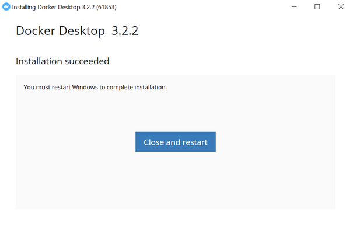
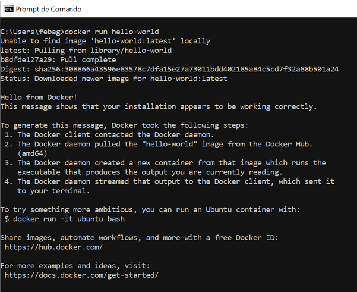

# **Como instalar o Docker no Windows 10**


## **Índice**<!-- omit in toc -->

- [**Observações Iniciais**](#observações-iniciais)
- [**Pré-requisitos**](#pré-requisitos)
- [**Instalação do Docker Desktop**](#instalação-do-docker-desktop)
- [**Possível erro**](#possível-erro)
- [**Verificação**](#verificação)
- [**Observações Finais**](#observações-finais)
- [**Para saber mais**](#para-saber-mais)

## **Observações Iniciais**

Neste tutorial, iremos ensinar como instalar o Docker Desktop no Windows 10. Mas antes de tudo, vamos a algumas observações:

Em primeiro lugar, para versões anteriores ao Windows 10, o Docker oferecia a opção de usar a Toolbox, mas recentemente deixaram de oferecer suporte e estão migrando tudo para o Docker Desktop, que está disponível apenas para Windows 10 até o momento. Caso você tenha uma versão anterior do Windows, não é recomendado utilizar o Docker Desktop, mas instalar o Docker dentro do WSL (ver tutorial aqui) ou em alguma distro do Linux (neste caso poderia ser em uma Virtual Machine (VM) ou com Dual Boot). 

Assim sendo, para usar o Docker Desktop, é necessário estar no: Windows 10 64-bit: Pro, Enterprise, ou Education (Build 17134 ou superior) - para Windows 10 Home, uma das exigências do Docker é o WSL2. Se você ainda não o instalou, **[clique aqui](/InstalationGuides/WSL.md)** e para mais informações veja os **[Requerimentos para WSL 2 backend](https://docs.docker.com/docker-for-windows/install/#system-requirements-for-wsl-2-backend)**.

## **Pré-requisitos**

Como dito acima, é necessário estar em alguma das versões citadas do Windows 10. 

Ok...mas como eu verifico qual versão do Windows estou? 

Para saber basta ir na barra de pesquisar e escrever “winver”, ali mostrará a versão do Windows que você se encontra!


Além disso, temos que verificar se a “Virtualização” está habilitada, para isso pesquise na barra de pesquisa: “Gerenciador de Tarefas” ou “Task Manager” e abra a aplicação:


Ao abrir o Gerenciador de Tarefas, vá até a aba de "Desempenho" e verifique se a "Virtualização" está habilitada, como mostra a figura abaixo. Se não conseguir visualizar a aba de desempenho, clique no “Mais Detalhes” no canto inferior esquerdo.


Se estiver habilitado podemos prosseguir com a instalação do Docker Desktop Installer, caso contrário recomendo seguir os passos no **[tutorial de Atualizando para o WSL2](/InstalationGuides/WSL.md)**. ~~Acho que já deu pra perceber que é bem importante que você atualize para o WSL2~~.

## **Instalação do Docker Desktop**

Para instalar o Docker Desktop Installer, basta clicar **[aqui](https://desktop.docker.com/win/stable/Docker%20Desktop%20Installer.exe)**.

Feito o download, podemos executar o arquivo e prosseguir com a instalação pelo Instalation Wizard!

Ao executar o arquivo, o Instalation Wizard abre:


Pode deixar as duas caixinhas assinaladas e clicar em "Ok". Com isso a instalação do Docker Desktop é iniciada junto com suas dependências. Se tudo ocorrer bem, você se deparará com a seguinte tela:



Com isso, será necessário reiniciar o sistema para completar a instalação. Para isso, é só clicar no botão azul "Close and restart", como mostra a figura acima. Então dê o restart aí e nos vemos daqui a pouco.

**Pronto!** Se tudo estiver certo, você já está com o Docker instalado na sua máquina! (sons de aplauso).

## **Possível erro**

Após a reinicialização, pode ocorrer o seguinte erro caso não tenha instalado completamente o WSL2:


Se isso acontecer, é porque você não seguiu ainda o **[tutorial de Atualizando para o WSL2](/InstalationGuides/WSL.md)**. Lá tem as instruções de como fazer a atualização do kernel do linux. Feito isso, clique em "Restart" e pronto! De qualquer forma, **[aqui](https://docs.microsoft.com/pt-br/windows/wsl/install-win10#step-4---download-the-linux-kernel-update-package)** está a docmentação oficial com as instruções e mais informações sobre a atualização necessária.

## **Verificação**

Agora vamos verificar se o Docker foi instalado corretamente!

Para isso, abra o prompt de comando:


Digite a seguinte linha e dê enter:

```bash
docker -v
```
A versão instalada será mostrada, como na figura:


Além disso, podemos testar se o Docker está funcionando corretamente com o Docker Hub, para testar isso digite no prompt de comando: 

```bash
docker run hello-world
```



Se a saída for que nem a de cima, está tudo **correto**! (mais sons de aplauso) 

## **Observações Finais**

Agora que você já instalou tudo direitinho, vamos te ensinar a abrir alguns atalhos que devem estar presentes no seu computador.

Você deve ter um atalho do Docker Desktop na sua área de trabalho:


E ser for nos ícones encontrará o Docker Desktop ali também:


Se passar o mouse por cima do ícone quando o Docker estiver ligado, aparecerá a seguinte mensagem:


E ao clicar com o botão direito do mouse sobre o ícone, você terá acesso ao seguinte menu:


Para entrar no Docker Desktop, basta clicar no atalho da área de trabalho ou duas vezes no ícone!

## **Para saber mais**

Para mais informações vejam o **[Manual do Usuário](https://docs.docker.com/docker-for-windows/)** e também o **[guia de instalação oficial do docker](https://docs.docker.com/docker-for-windows/install/)**, que serviu de referência para este tutorial.
