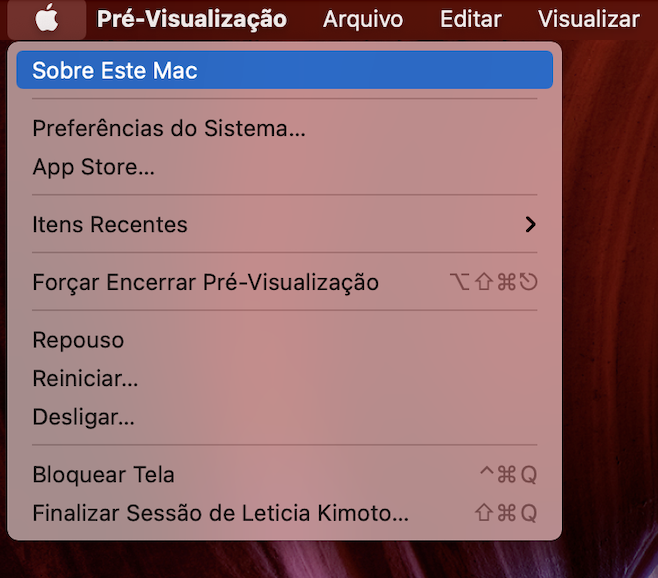
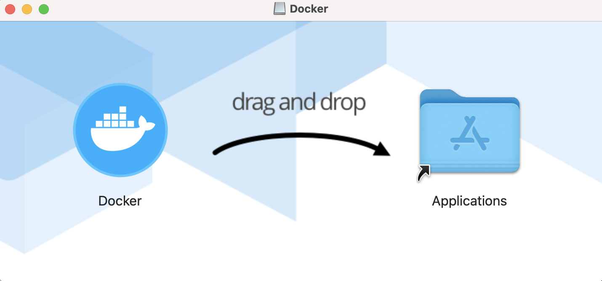
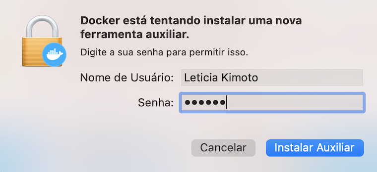
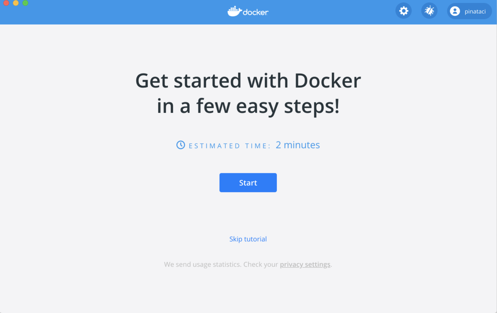

# **Como instalar o Docker no Mac**


## **Índice**<!-- omit in toc -->

- [**Observações Iniciais**](#observações-iniciais)
- [**Pré-requisitos**](#pré-requisitos)
- [**Instalação do Docker Desktop**](#instalação-do-docker-desktop)
- [**Possível erro**](#possível-erro)
- [**Verificação**](#verificação)
- [**Observações Finais**](#observações-finais)
- [**Para saber mais**](#para-saber-mais)

## **Observações Iniciais**

Neste tutorial, iremos ensinar como instalar o Docker Desktop no Mac. Mas antes de tudo, vamos a algumas observações:

Para usar o Docker Desktop, o macOS deve estar na **versão 10.14 ou mais recente**, ou seja: Mojave, Catalina ou Big Sur.

Além disso, é necessário ter pelo menos 4GB de RAM e o VirtualBox anterior à versão 4.3.30 não deve ser instalado, pois não é compatível com Docker Desktop.

## **Pré-requisitos**

Como dito acima, é necessário estar em alguma das versões citadas do Mac. 

Ok...mas como eu verifico qual versão do macOS estou? 

Para saber basta ir no canto superior esquerdo da tela, clicar no símbolo da Apple e depois em "Sobre Este Mac". Ali mostrará a versão do Mac que você se encontra!




## **Instalação do Docker Desktop**

Para instalar o Docker Desktop Installer, basta entrar **[aqui](https://hub.docker.com/editions/community/docker-ce-desktop-mac/)**, e depois clicar em **"Get Docker"**.


Feito o download, clique 2 vezes no **Docker.dmg** para abrir o instalador. Aberta a janela, leve o ícone do Docker para a pasta "Applications", conforme a imagem: 



Dado o tempo de instalação, clique 2 vezes no ícone do Docker. Talvez poderá aparecer uma janela perguntando se deseja abrir o app baixado da internet. Clique em "Abrir". 

Depois, o Docker pedirá acesso. Clique em "OK" e insira sua senha do Mac para permitir a operação. Por fim, clique em "Instalar Auxiliar".




**Pronto!** Se tudo estiver certo, abrirá a página inicial do Docker! (sons de aplauso)



## **Verificação**

Agora vamos verificar se o Docker foi instalado corretamente!

Para isso, abra o Terminal (clique na lupa no canto superior direito e busque "Terminal").


Digite a seguinte linha e dê enter:

```bash
docker -v
```
A versão instalada será mostrada, como na figura:


Além disso, podemos testar se o Docker está funcionando corretamente com o Docker Hub, para testar isso digite no prompt de comando: 

```bash
docker run hello-world
```


Se o output for que nem o de cima, está tudo **correto**! (mais sons de aplauso) 

## **Observações Finais**

Se o ícone quando o Docker estiver presente no canto superior direito da tela, significa que ele está ligado.


Para entrar no Docker Desktop das próximas vezes, basta buscar na lupa ou no Launchpad!

## **Para saber mais**

Sugiro dar uma lida no **[Manual do Usuário](https://docs.docker.com/docker-for-mac/)** e deixo aqui também a **[referência](https://docs.docker.com/docker-for-mac/install/)** deste tutorial.