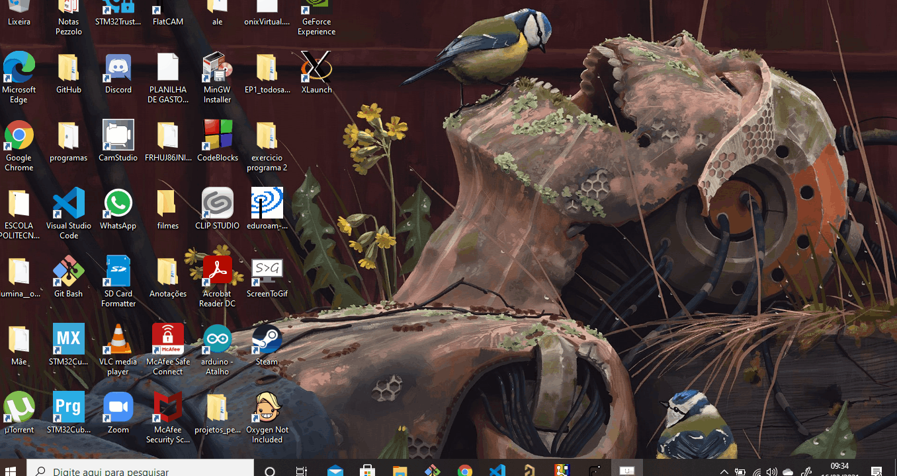

# **Instalando o ROS/Gazebo em sua máquina com o WSL**

Neste tutorial, vamos aprender a **instalar** o framework chamado **ROS** em sua máquina. Junto com ele, vem o simulador **Gazebo**, que permite com que você faça o seu robôzinho andar por aí.
Se quiser aprender mais e entender para que servem ROS e Gazebo, veja os documentos explicativos (o que é? / porque usar?) sobre cada um deles - com certeza vai iluminar melhor a questão.

Vamos, neste documento, dar um enfoque a como instalar ROS/Gazebo no Windows com WSL.

Se você está utilizando Ubuntu, você está lendo o artigo errado. ***[Clique aqui](../InstalationGuides/ROSGazeboUbuntu.md)*** para se redirecionar.

## **Índice**

- [**O que vamos usar?**](#o-que-vamos-usar)
- [**Habilitando Repositórios**](#habilitando-repositórios)
- [**Ajustar a sources.list**](#ajustar-a-sourceslist)
- [**Ajustar as chaves**](#ajustar-as-chaves)
- [**Finalmente, a instalação!**](#finalmente-a-instalação)
- [**Toques finais**](#toques-finais)
- [***Instruções para pós instalação***](#instruções-para-pós-instalação)


## **O que vamos usar?**

Os passos da instalação do ROS/Gazebo são similares ao Ubuntu sem o WSL:

Abra o terminal do Ubuntu no Windows




## **Habilitando Repositórios**

Primeiramente, para instalar ROS no Ubuntu em WSL, precisamos configurar os **repositórios Ubuntu** para habilitar os repositórios *"restricted", "universe", e "multiverse"*. Podemos fazer isso com os seguintes comandos:

``` bash
sudo add-apt-repository restricted
sudo add-apt-repository universe
sudo add-apt-repository multiverse
sudo apt update
```
A resposta para esses comandos deve ser essa:


Esses comandos permitem com que a sua máquina obtenha arquivos de diferentes tipos de repositório.

Mas o que é um repositório?

Sucintamente, um repositório é um **servidor** que contém diversos **pacotes**, isto é, arquivos e programas, que estão disponibilizados para usuários instalarem em suas máquinas. Por padrão, o Ubuntu não habilita o acesso aos repositórios restricted, universe e multiverse mas para instalar o ROS precisamos de acesso a esses servidores.

Em nosso caso, para instalar ROS precisamos de acesso a estes servidores, e por isso inserimos estes comandos.

Para saber mais sobre as diferenças dos repositórios, acesse o link:
<https://help.ubuntu.com/community/Repositories>

Em seguida, vamos configurar algumas coisas para que a sua máquina consiga buscar e aceitar o arquivo do servidor fornecedor.

## **Ajustar a sources.list**

Vamos agora ajustar o computador para aceitar pacotes do **repositório do ROS** :

```bash
sudo sh -c 'echo "deb http://packages.ros.org/ros/ubuntu $(lsb_release -sc) main" > /etc/apt/sources.list.d/ros-latest.list'
```

## **Ajustar as keys**

Insira o seguinte comando para salvar as chaves do repositório do ROS na sua máquina:

```bash
sudo apt-key adv --keyserver 'hkp://keyserver.ubuntu.com:80' --recv-key C1CF6E31E6BADE8868B172B4F42ED6FBAB17C654
```

As chaves são necessárias para acesso ao repositório do ROS, do qual instalaremos nossos arquivos. Se você não fizer esta parte, não terá acesso à ele e não conseguirá instalar.

**Respostas esperadas:**


## **Finalmente, a instalação!**

Primeiro, vamos rodar um comando para atualizar o sistema com as modificações que fizemos até agora:

```bash
sudo apt update
```
Feito isso, vamos instalar o pacote do ROS. **Precisamos** instalar o pacote **"desktop-full"** para instalar os adendos responsáveis por simulação 2D/3D -- como o *Gazebo* -- senão faltarão pacotes na máquina. Assim, o comando é:

```bash
sudo apt install ros-noetic-desktop-full
```
Este comando deve instalar o ROS e o Gazebo juntos. Podemos também instalar pacotes específicos diretamente por meio do seguinte comando:
```bash
sudo apt install ros-noetic-PACKAGE
```
Sendo PACKAGE o nome do pacote a ser instalado -- mas isso não será necessário por enquanto.

**Resposta esperada:**


## **Toques finais**

Toda vez que você abrir um terminal, é necessário executar o seguinte comando para habilitar o ambiente ROS na sua sessão de terminal:

```bash
source /opt/ros/noetic/setup.bash
```

Rodar esse comando manualmente sempre pode se tornar trabalhoso. Como nós somos pessoas preguiçosas, configuramos o sistema para fazer isso automaticamente.

A maneira de fazer isso é a seguinte:

```bash
echo "source /opt/ros/noetic/setup.bash" >> ~/.bashrc
source ~/.bashrc
```

O que esse comando faz é adicionar a linha de texto `source /opt/ros/noetic/setup.bash` para o arquivo `.bashrc`. Este arquivo contém uma lista de comandos que são executados toda vez que um novo terminal é aberto. Dessa forma, você não precisa escrever o mesmo comando sempre

**Resposta esperada:**


## ***Instruções para pós instalação***

Após preparar o ambiente, a instalação do ROS e do Gazebo estará finalizada!

Mas vamos com calma ainda, amigo. Para utilizar o ROS e suas extensões pelo WSL será necessario instalar o Xserver, que também temos um guia de instalação!

Para instalar o Xserver  ***[clique aqui](../InstalationGuides/XServer.md)***

Depois disso tudo isso, seu windows estará pronto para utilizar corretamente o ROS.

Bom proveito!
