Durante as atividades que serão exercidas neste projeto é necessário utilizar métodos que facilitem a interação entre o grupo. Dado a situação de educação à distância, a comunicação e o desenvolvimento do projeto podem ficar confusos. Por isso, iremos apresentar nessa seção uma ferramenta que pode auxiliar o grupo com esses problemas: o GitHub.

Para uma abordagem mais detalhada, é altamente recomendável assistir as aulas de Git disponibilizadas pela equipe ThundeRatz no YouTube. As duas aulinhas são curtas e tem cerca de 13 minutos cada, e estão disponíveis nos seguintes links:

- [Aula de Git e GitHub - Parte conceitual](https://www.youtube.com/watch?v=nb8BoPCD5h4)
- [Aula de Git e GitHub - Parte prática](https://www.youtube.com/watch?v=jFiit3u-uKY)

Este texto terá uma abordagem bem mais prática, focada na ferramenta **GitHub Desktop**.

# Utilizando o GitHub e o GitHub Desktop

## Criando uma conta no GitHub

O GitHub é um site que permite criar um projeto e adicionar diversos colaboradores nele, promovendo a colaboração remota e auxiliando na resolução de erros, além de evitar a perda de comunicação. 

O primeiro passo a se fazer é se registrar no GitHub por meio [deste link](https://github.com/join?ref_cta=Sign+up&ref_loc=header+logged+out&ref_page=%2F&source=header-home).

A seguinte tela irá aparecer. Nela, preencha as suas informações como mostrado no exemplo:
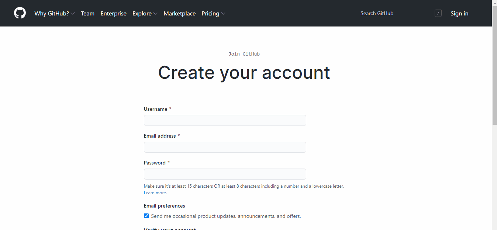{: .d-block .mx-auto}

Após isso, uma tela de costumização irá aparecer. Preencha de acordo com os seus interesses.

{: .d-block .mx-auto}

Agora, o GitHub pedirá para que você verifique seu email. É só checar sua caixa de entrada e você deverá ter recebido um email parecido com este:

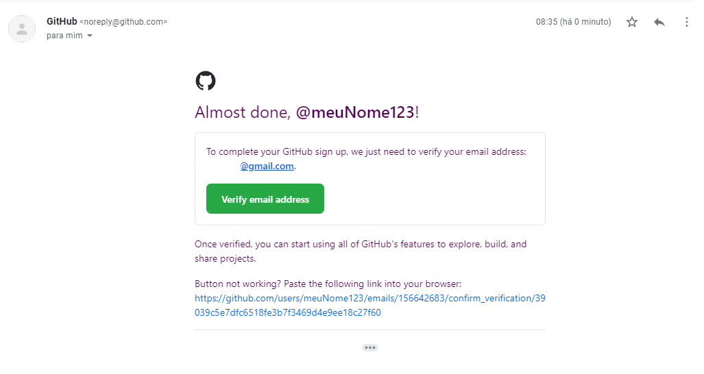{: .d-block .mx-auto}

É só clicar em **Verify email address** e você será redirecionado para a seguinte tela, se tudo estiver certo:

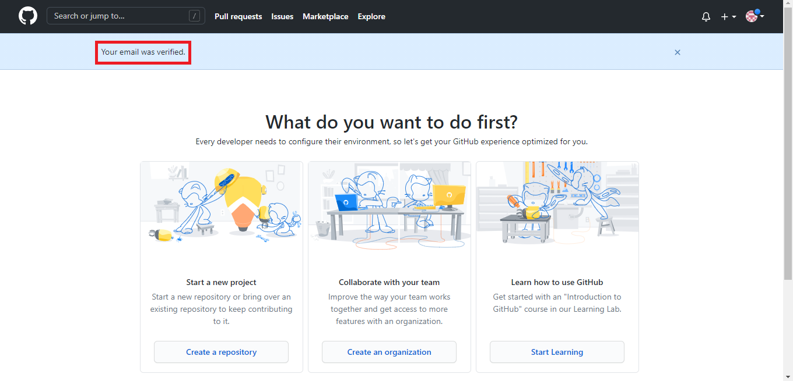{: .d-block .mx-auto}

## Criando um projeto no GitHub

Para iniciar um projeto no GitHub, é necessário ir até a página inicial e clicar em **Create a repository**.

{: .d-block .mx-auto}

Agora, preencha com as informações desejadas. Primeiro, você deve dar um nome para seu projeto. Após isso, você pode escolher entre ter um repositório **público** ou **privado**, ou seja, se ele pode ser visto por qualquer um ou apenas por pessoas selecionadas.
No exemplo, vou criar um repositório privado.

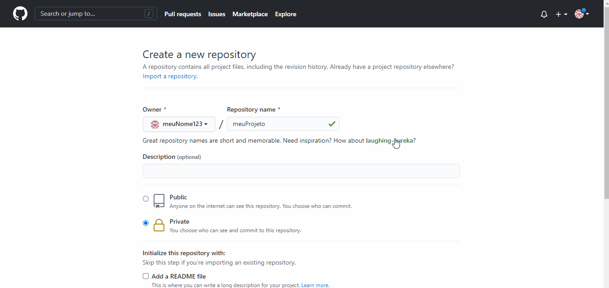{: .d-block .mx-auto}

Se estiver tudo certo, você deve acabar numa página similar a essa:

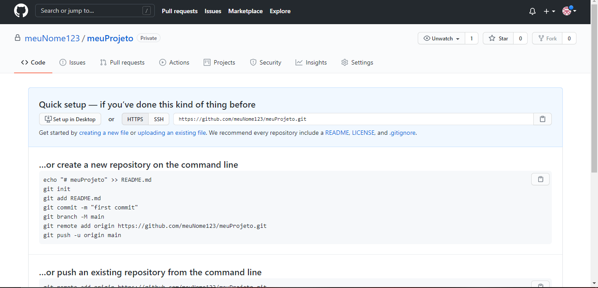{: .d-block .mx-auto}

e, caso você vá para a página inicial, seu repositório estará disponível na barra ao lado:

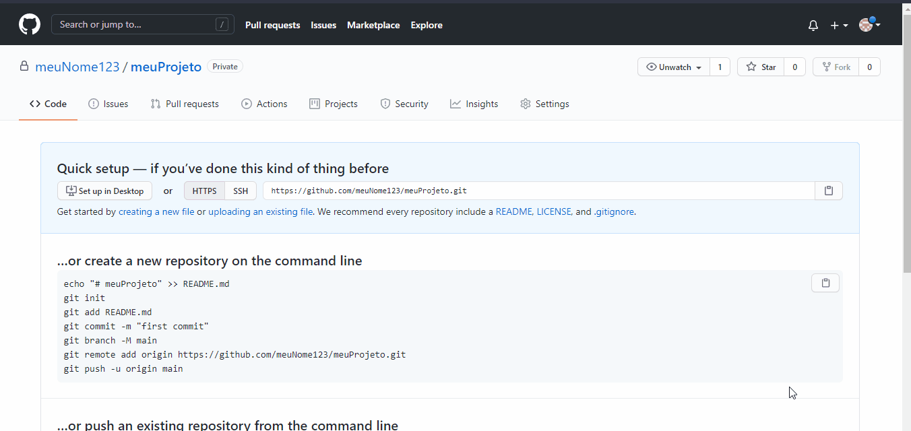{: .d-block .mx-auto}

## Adicionando colaboradores ao repositório

Agora que você já sabe como criar um projeto no GitHub, é também importante entender como ele irá ser útil para tornar os trabalhos em grupos mais simples. O GitHub permite que o usuário adicione colaboradores no seu projeto, permitindo assim, que um integrante do grupo adicione os outros integrantes para que todos possam auxiliar no desenvolvimento do projeto. Mas como fazer isso?

O primeiro passo é entrar em seu repositório e clicar na aba **Settings** e ir na subcategoria **Manage access** e clicar em **Invite collaborators**.

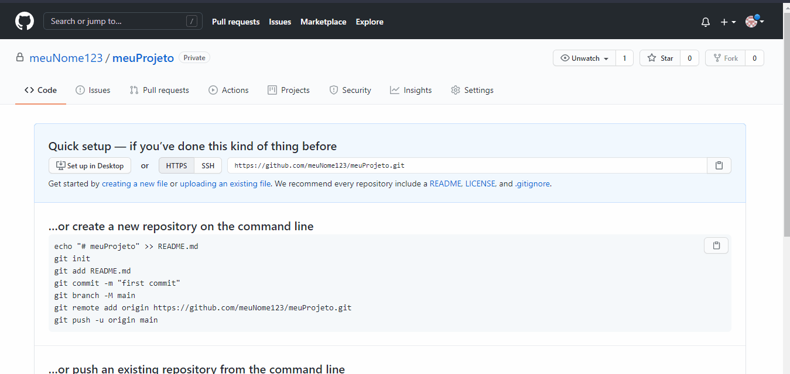{: .d-block .mx-auto}
Daí, é só digitar os emails/nomes de usuário dos seus colegas de grupo.

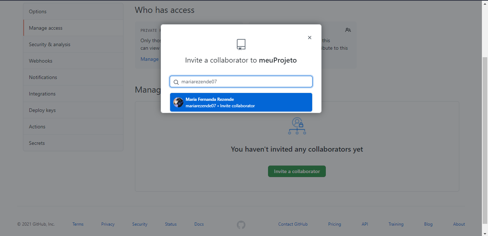{: .d-block .mx-auto}

Após esse primeiro passo, é possível adicionar mais colaboradores futuramente ao clicar em **Invite a collaborator**

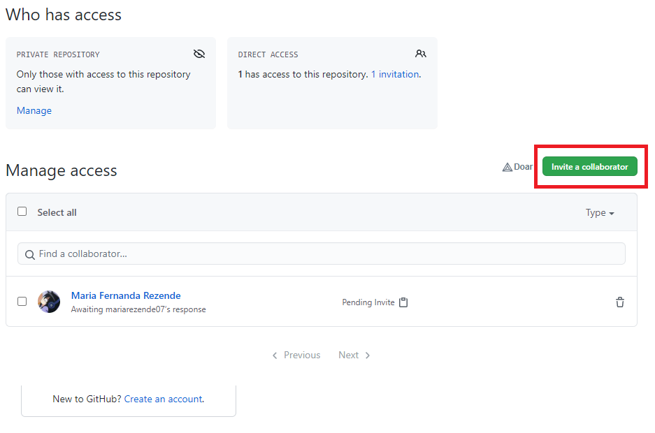{: .d-block .mx-auto}
___
Agora, vamos deixar isso um pouco de lado e entender como iremos mexer nos nossos projetos por meio dessa plataforma. Para isso, vamos instalar a ferramenta **GitHub Desktop**, que permite que você use o Git sem a necessidade de saber linhas de comando.

## Instalando o GitHub Desktop

Para instalar o GitHub Desktop é preciso fazer o *download* da aplicação por meio [**deste link**](https://desktop.github.com/).

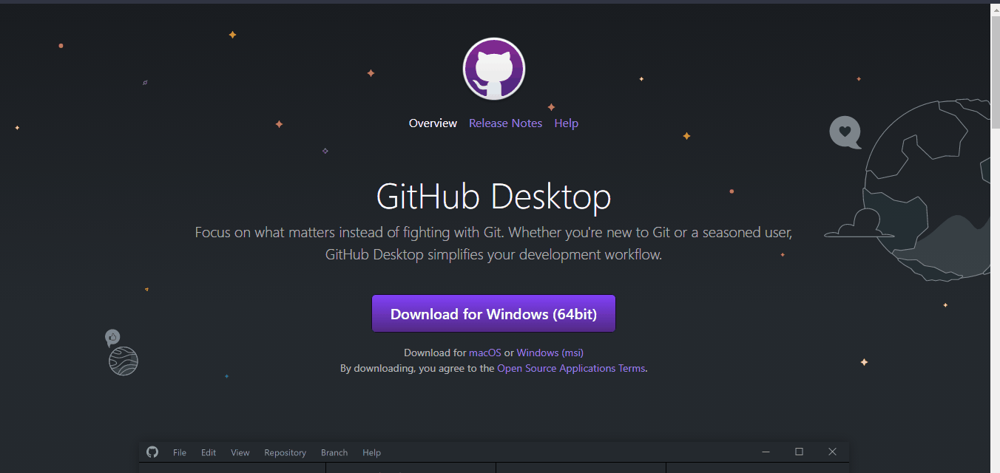{: .d-block .mx-auto}

Após fazer o *download*, é só executar a aplicação e após a instalação ela abrirá automaticamente. Durante a instalação, não é necessário fazer nada, e você provavelmente se deparará com a seguinte tela:

{: .d-block .mx-auto}

E depois do aplicativo ter sido instalado, você irá ter a seguinte tela:

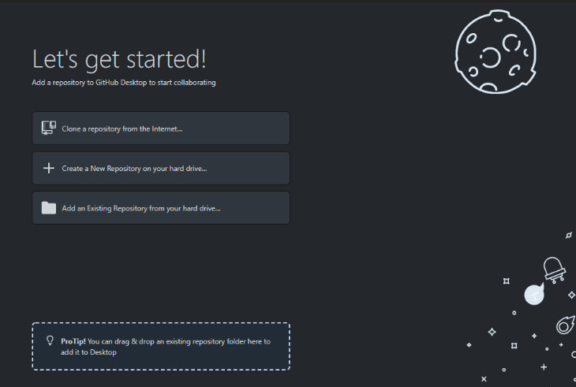{: .d-block .mx-auto}

## Configurando um repositório no GitHub Desktop

A partir dessa tela inicial, clique em **Clone a repository from internet** e, dentre os projetos, escolha o que você faz parte.

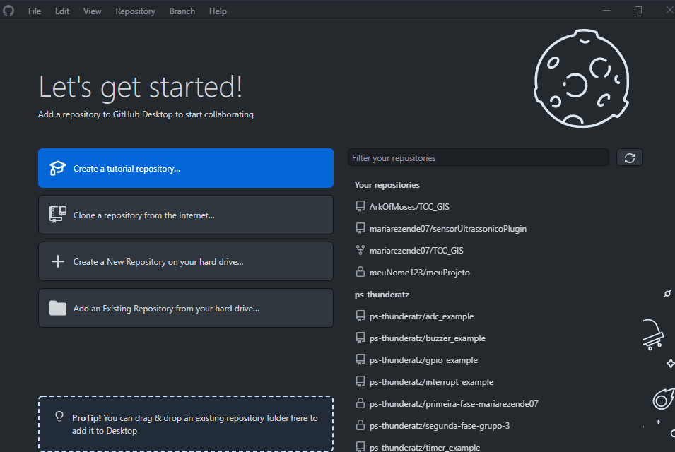{: .d-block .mx-auto}

Agora você terá a seguinte tela:

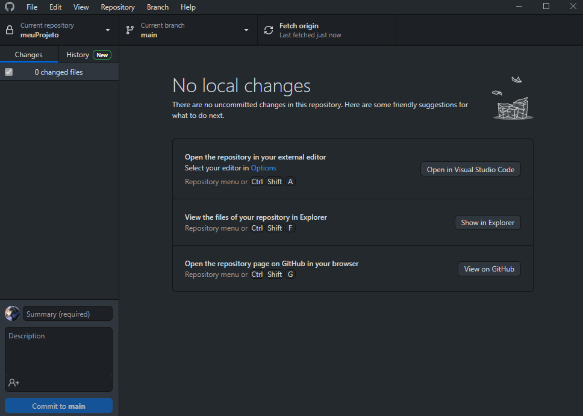{: .d-block .mx-auto}

Com isso, faça as mudanças necessárias com seu editor de código preferido. Após feitas, as mudanças aparecerão nessa tela da seguinte forma:

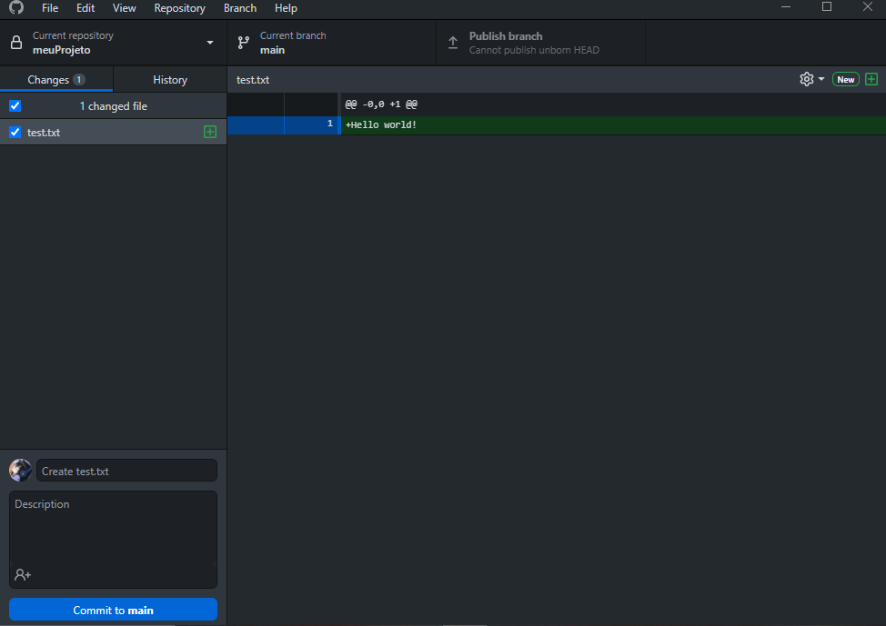{: .d-block .mx-auto}

Para publicar suas mudanças no repositório é necessário ir na barra no lado inferior esquerdo e clicar em **Commit to main**.

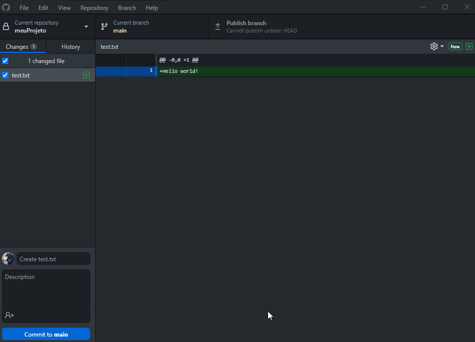{: .d-block .mx-auto}

Na primeira mudança, você deverá publicar sua *branch*.

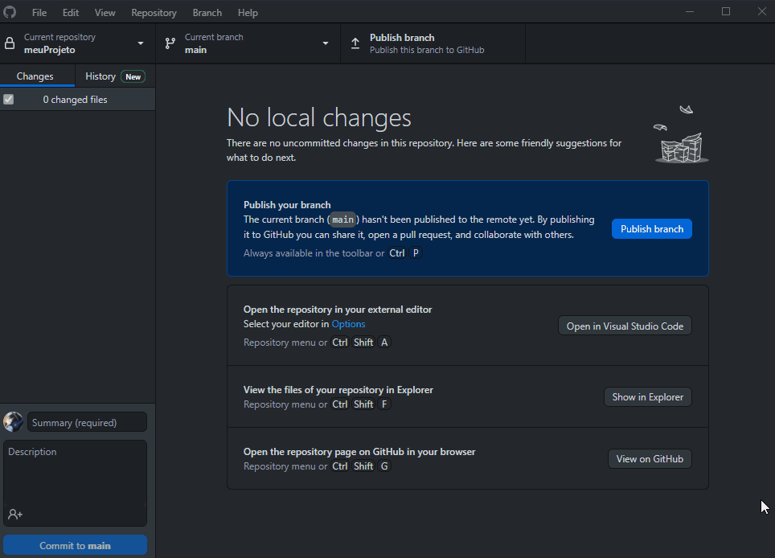{: .d-block .mx-auto}

Porém, nas outras mudanças você deverá apenas fazer um *push* para que elas estejam disponíveis a todos no repositório.

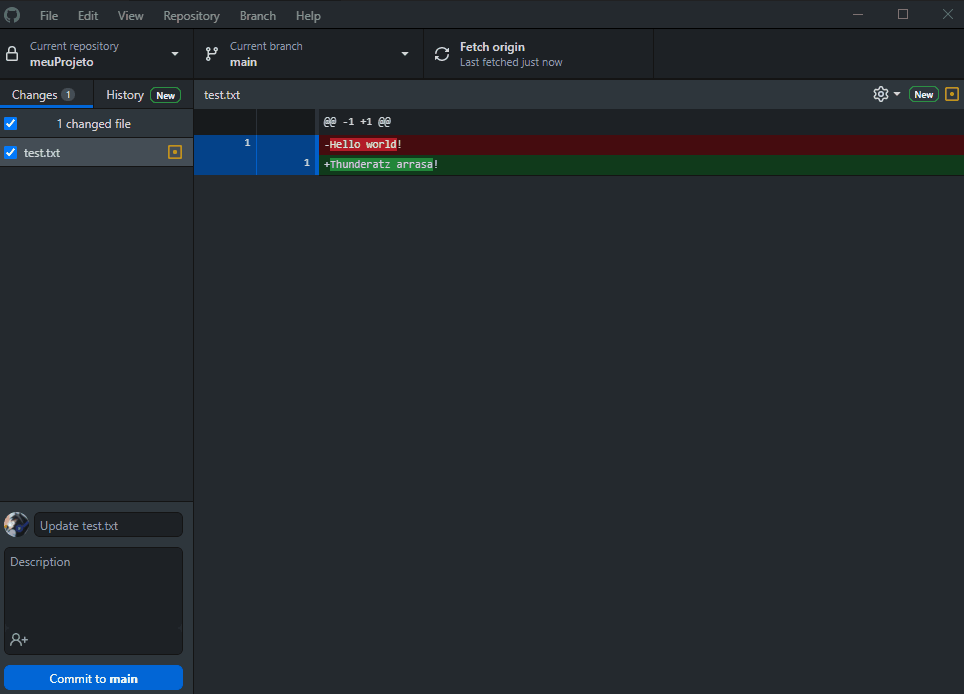{: .d-block .mx-auto}

Pronto! Agora é só fazer suas mudanças e publicá-las em seu projeto.

## **Importante**

Como isso se trata de um projeto em grupo, os outros integrantes também estarão fazendo mudanças no repositório. Para evitar problemas, sempre que um colega fizer mudanças, vá até a página inicial e clique em **Fetch Origin**.

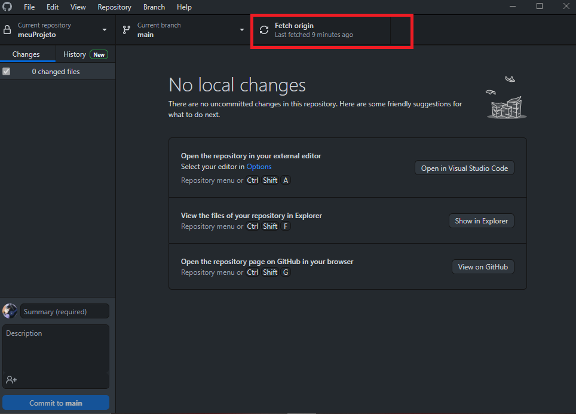{: .d-block .mx-auto}

Caso houverem mudanças, clique em **Pull from origin**.

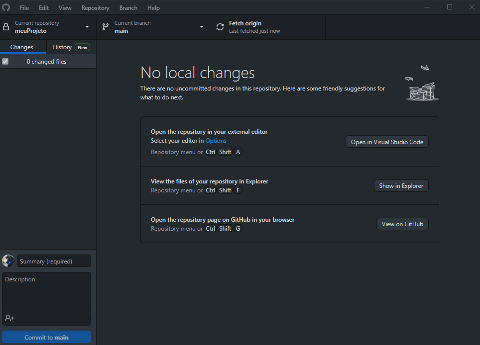{: .d-block .mx-auto}

___

É importante lembrar que o GitHub não é um método a prova de falhas e problemas poderão acontecer. Caso houver qualquer dúvida durante a utilização dele, não hesite em perguntar para os monitores!
