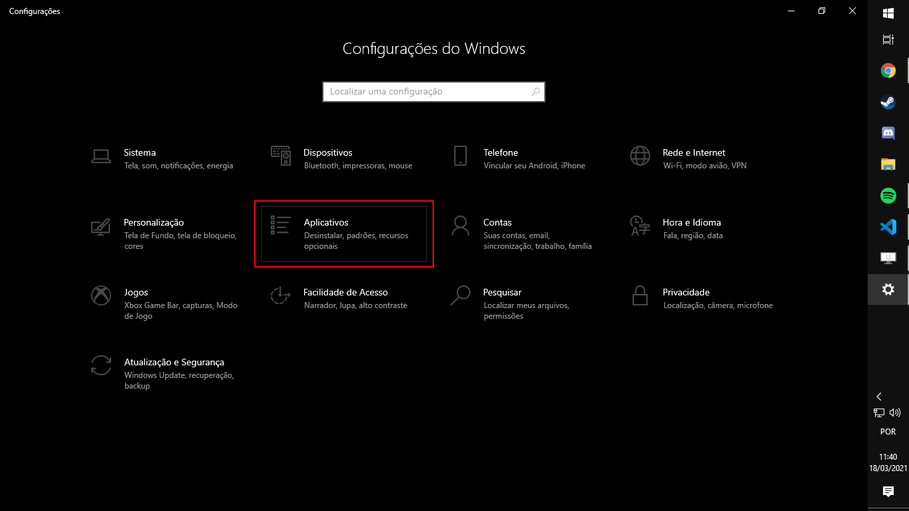
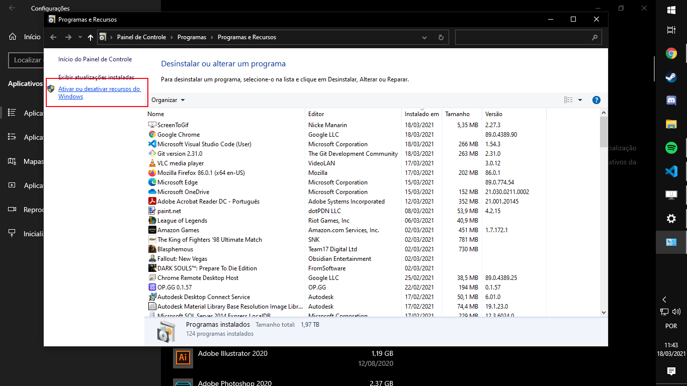
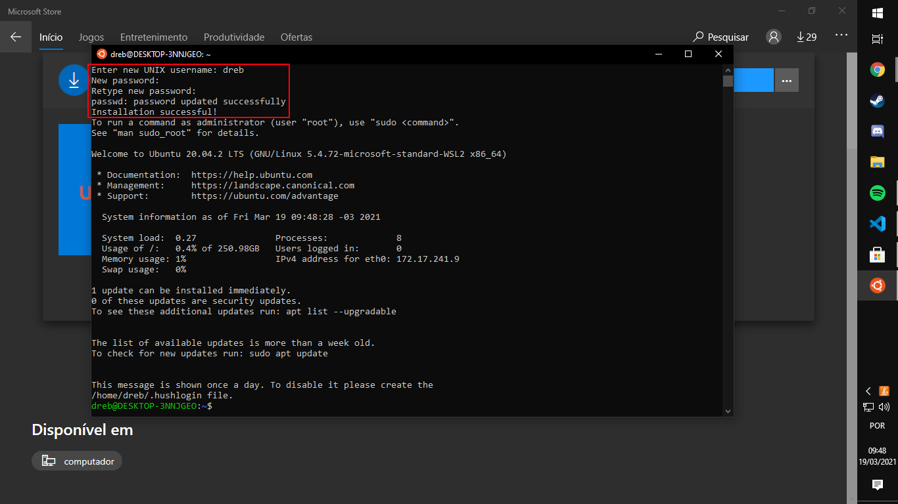

# Instalando o WSL na sua máquina Windows!

Olá alunos!

Neste tutorial, vamos aprender a **instalar** o **WSL**, abreviação de *Windows Subsystem for Linux*, no seu PC. Basicamente é uma camada de compatibilidade pra rodar um ambiente de Linux, direto do sistema da Microsoft. Isso traz uma facilidade para o uso e também deixa você continuar no ambiente Windows. Você vai poder rodar todos os comandos e programas específicos ao Linux sem ter que realmente realizar uma instalação completa dele em um pedaço do seu HD. Se quiser saber mais, sinta-se a vontade de perguntar para os monitores e conferir a [página de documentação oficial da Microsoft sobre o assunto](https://docs.microsoft.com/en-us/windows/wsl/about).

### O que vamos usar?

O tutorial em grande parte vai ser praticamente só navegar pelos muitos menus presentes no Windows. Tudo que você precisa para ativar o WSL e ter uma instalação de Ubuntu no seu PC já está aí, só precisamos encontrar!

Todas as imagens vão mostrar uma instalação em Português do Windows, com os nomes de coisas importantes escritos em **negrito**. Ao lado, ficará a tradução para Inglês em *itálico*.

Primeiramente, você vai ter que habilitar o WSL no Windows. Para isso abra a janela de **Configurações**/*Settings*.

Então, clique em **Aplicativos**/*Apps*.

Em seguida, na lateral direita, logo abaixo de **Configurações relacionadas**/*Related settings*, clique em **Programas e Recursos**/*Programs and Features*.

Nesta nova tela, encontre e clique na opção **Ativar ou desativar recursos do Windows**/*Turn Windows features on or off*, na lateral esquerda.

Em seguida, coloque um check na caixinha escrito **Subsistema do Windows para Linux**/*Windows Subsystem for Linux*. Então clique em OK, aguarde as alterações e reinicie seu computador para aplicar as modificações.

Para facilitar, no gif a seguir temos o processo inteiro que você deve realizar (ele foi editado pra ficar mais curto então não se espantem se demorar na tela final):

Com o PC devidamente reiniciado chegamos na parte mais fácil do tutorial, instalar sua distribuição de Linux. Para isso é preciso abrir a **Microsoft Store**.

Agora diretamente na barra de pesquisa procure por "Linux" e escolha uma distribuição para instalar na sua máquina. Para essa disciplina vamos usar o [Ubuntu 20.04 LTS](https://www.microsoft.com/en-us/p/ubuntu/9nblggh4msv6?activetab=pivot:overviewtab).

Abrindo a página do Ubuntu 20.04 LTS, caso você nunca tenha baixado, é só apertar no botão **Obter**/*Get* e fazer o login com sua conta da Microsoft para adquirir a distribuição.

Com a distribuição obtida, agora é só instalar como se fosse um app normal de celular. Aperte o botão **Instalar**/*Install* e aguarde o processo.

Finalizada a instalação, aperte no botão **Iniciar**/*Launch* para rodar o Ubuntu pela primeira vez. Você também pode abrir pelo menu iniciar. Deve ser o primeiro programa que aparece.

Agora, depois de abrir e aguardar a primeira instalação, você tem que escolher o nome de usuário para a distribuição na linha "Enter new UNIX username". Ele não precisa ser o mesmo da sua máquina Windows mas tem que ser todo em letras minúsculas.

Com um nome de usuário, agora é apenas colocar o sua senha na linha "Enter new UNIX password" e escrever ela de novo em seguida para confirmar.

E acabou!

Agora que você tem o WSL com Ubuntu 20.04 instalado na sua máquina você pode tirar proveito dos softwares que rodam no Linux, como o ROS/Gazebo, usados na disciplina. Para aprender como instalar eles é só ***[clicar aqui](../InstalationGuides/ROSGazeboWSL.md)*** e seguir as instruções.

Se tiver qualquer dúvida, sinta-se a vontade de falar com um dos monitores.

Que o ambiente Linux seja muito receptivo!
