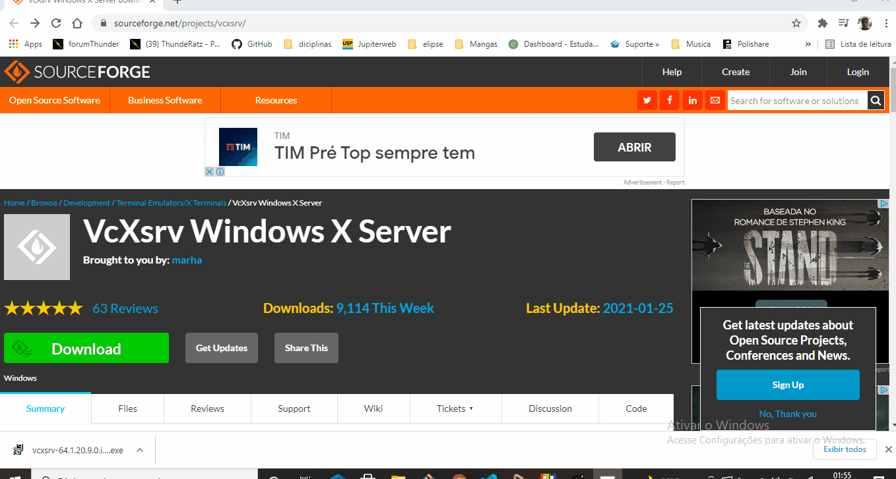
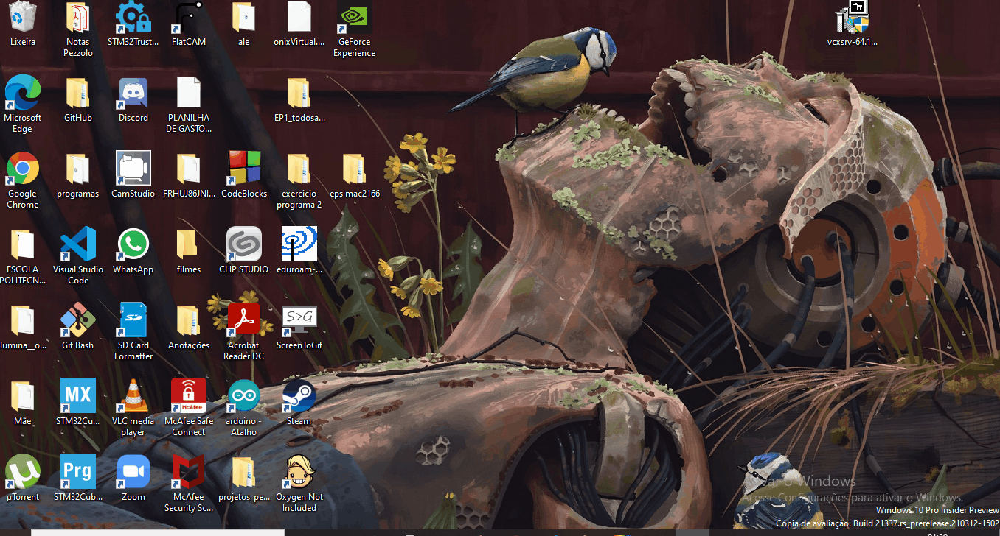
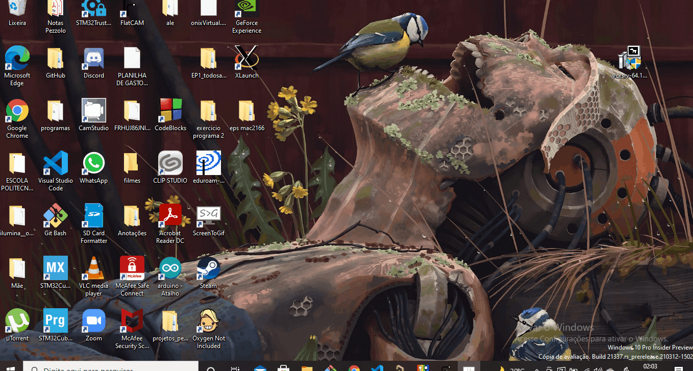
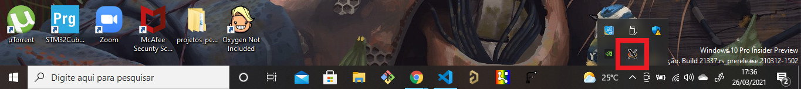
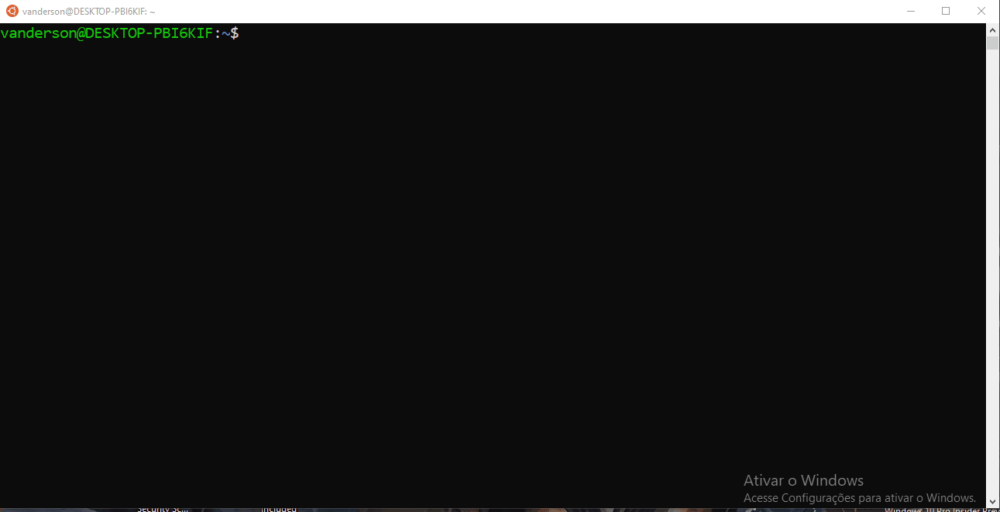
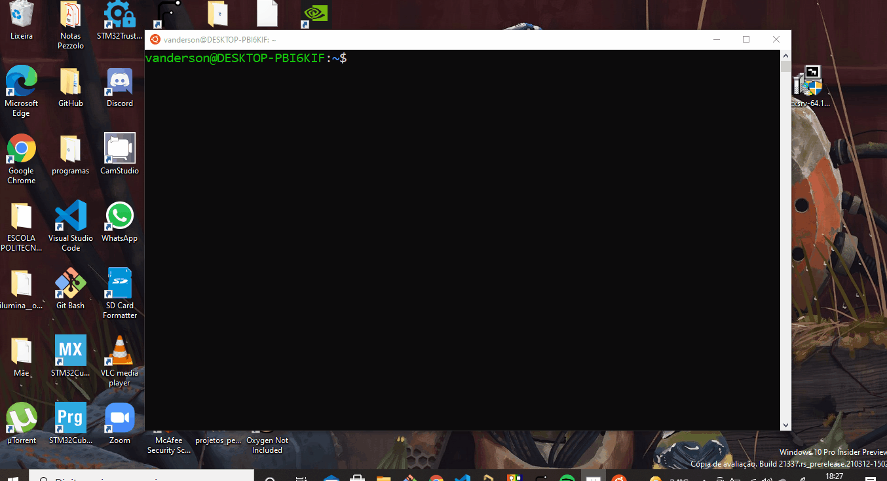

# **Como Instalar o Xserver no Windows**

Neste tutorial, vamos aprender a **instalar** o Xorg Server chamado **Xserver** em sua máquina.
Após a instalação do WSL e ROS, o seu sistema operacional ainda não consegue reproduzir o Gazebo. Por conta disso, nesse tutorial iremos mostrar uma ferramenta que possibilita a reprodução desses programas no Windows.

Não é necessário ter o ROS/Gazebo instalado no seu computador para seguir esse tutorial, mas é necessario o WSL para os toques finais. Contudo, recomendo que faça esse tutorial por último.

***[Clique aqui](../InstalationGuides/WSL.md)*** para ser direcionado ao tutorial de instalação do WSL.

***[Clique aqui](../InstalationGuides/ROSGazeboWSL.md)*** para ser direcionado ao tutorial de instalação do ROS/Gazebo.
## **Índice**<!-- omit in toc --> 

- [**Download e execução do arquivo VcXsrv**](#Download-e-execução-do-arquivo-VcXsrv)
- [**Execução e configuração do Xlaunch**](#Execução-e-configuração-do-Xlaunch)
- [**Toques finais**](#Toques-finais)
- [**Teste de funcionamento**](#Teste-de-funcionamento)
- [**Instruções para pós instalação**](#Instruções-para-pós-instalação)

## **Download e execução do arquivo VcXsrv**

- **Baixe** o arquivo **VcXsrv Windows X Server** e **salve** no seu local de preferência:

    - ***[Clique aqui](https://sourceforge.net/projects/vcxsrv/)*** para baixar o VcXsrv Windows X Server.



- Execute e instale o arquivo **"vcxsrv-64.1.x.x.x.installer"** (obs.: os 'x' estão no lugar da versão, ou seja, desde que estaja dentro da "vcxsrv-64.1", está tudo bem baixar essa opção)
    
    - O arquivo, a priori, já vem com as configurações adequadas, porém, certifique-se que a opção de instalação está "full" e que todas as "caixinhas" estão selecionadas. 
    


## **Execução e configuração do Xlaunch**

Após baixar e executar o arquivo "vcxsrv-64.1.x.x.x.installer", ele irá criar um arquivo chamado **Xlaunch** na sua área de trabalho (desktop, se o seu computador estiver em inglês)
Toda vez que computador for reiniciado, esse passo deve ser feito novamente.

- Execute o **Xlaunch**
- Na aba de configuração de display (select display settings):
    - Deixe **"Multiple windows"** selecionado;
    - Deixe **"display number"** em **0**.

- Na aba de seleção de como iniciar o cliente (select how to start clients):
    - Selecione **"Start no client"**.

- Na aba de configurações extras (extra settings):
    - Deixe selecionado **"Clipboard"**, **"Primary Selection"** e **"Disable acess control"**

Ao final da instalação, há a opção de salvar as configurações feita, para que não precise refazer os mesmos passos acima toda vez que for iniciar o X Server.

- Salvar configurações(opcinal):
    - **Clique** no icone **"Save Configuration"**;
    - **Nomeie** o arquivo como preferir e **Salve** no seu local de preferência.

Depois disso, basta clicar no arquivo de configurações salvo para iniciar o X Server.



- Para saber se foi inicializado, certifique-se que existe na extremidade inferior direita o símbolo do Xlaunch.



## **Toques finais**

Para conseguir fazer esses toques finais, é necessário ter, pelo menos, o WSL instalado no Windows.

Caso não tenha feito isso ainda, volte para o inicio da página  [**clicando aqui**](#Como-Instalar-o-Xserver-no-Windows) e siga o tutorial de instalação do WSL.

- **Abra** o **terminal** do Ubuntu no Windows e digite o seguinte comando:

```bash
echo "export DISPLAY=:0" >> ~/.bashrc
source ~/.bashrc
```
Não se preocupe se o terminal não responder nada depois destes comandos -- ele realmente não dá nenhum sinal de que os comandos foram feitos de maneira correta. Na verdade, se não apareceu nada, você provavelmente fez tudo certo.

Observação:
- Caso esteja usando o WSL2, digite o seguinte no lugar do último comando:

```bash
echo "export DISPLAY=$(cat /etc/resolv.conf | grep nameserver | awk '{print $2}'):0" >> ~/.bashrc
source ~/.bashrc
```

## **Teste de funcionamento**
Com todos os passos acima concluidos, só precisamos nos certificar qu está tudo funcionando.

- **Abra** o **terminal** do Ubuntu e **Instale** o pacote `mesa-utilis` com o seguinte comando:

```bash
sudo apt install mesa-utils
```



- **Digite** no terminal o seguinte comando:

```bash
glxgears
```

Depois dessa série de comandos, deve aparecer três engrenagens coloridas girando:



## **Instruções para pós instalação**
Depois disso, está pronta a instalação do Xserver.

Após a instalação do WSL, ROS/Gazebo e Xserver, o seu computador está pronto para as experiências que serão realizadas nas aulas!

Bom proveito!

Para aprender a executar seu projeto no Windows, ***[clique aqui](../HowToRun/RunOnWSL.md)*** 
