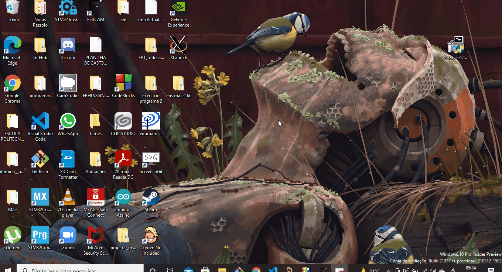

# **Como Instalar o Xserver no Windows**

Neste tutorial, vamos aprender a **instalar** o Xorg Server chamado **Xserver** em sua máquina.
Após a instalação do WSL e ROS, o seu sistema operacional ainda não consegue reproduzir o Gazebo. Por conta disso, nesse tutorial iremos mostrar uma ferramenta que possibilita a reprodução desses programas no Windows.

Não é necessário ter o WSL e ROS/Gazebo instalado no seu computador para seguir esse tutorial, porém é recomendado que se faça esse tutorial por último.

***[Clique aqui](../InstalationGuides/WSL.md)*** para ser direcionado ao tutorial de instalação do WSL 

***[Clique aqui](../InstalationGuides/ROSGazeboWSL.md)*** para ser direcionado ao tutorial de instalação do ROS/Gazebo
## **Índice**<!-- omit in toc --> 

- [**Download e execução do arquivo VcXsrv**](#Download-e-execução-do-arquivo-VcXsrv)
- [**Execução e configuração do Xlaunch**](#Execução-e-configuração-do-Xlaunch)
- [**Instruções para pós instalação**](#Instruções-para-pós-instalação)
## **Download e execução do arquivo VcXsrv**
- **Baixe** o arquivo **VcXsrv Windows X Server** e **salve** no seu local de preferencia:

 ***[clique aqui](https://sourceforge.net/projects/vcxsrv/)*** para baixar o VcXsrv Windows X Server

- Execute e instale o arquivo **"vcxsrv-64.1.x.x.x.installer"** (obs.: os 'x' estão no lugar da versão, ou seja, desde que estaja dentro da "vcxsrv-64.1", está tudo bem baixar essa opção)
    
    - O arquivo, a priori, já vem com as configurações adequadas, porém, certifique-se que a opção de instalação está "full" e que todas as "caixinhas" estão selecionadas. 

## **Execução e configuração do Xlaunch**

Após baixar e executar o arquivo "vcxsrv-64.1.x.x.x.installer", ele irá criar um arquivo chamado **Xlaunch** na sua área de trabalho (Desktop, se o seu computador estiver em inglês)
Toda vez que computador for reiniciado, esse passo deve ser feito novamente.

- Execute o **Xlaunch**
- Na aba de configuração de display (select display settings):
    - Deixe **"Multiple windows"** selecionado;
    - Deixe **"display number"** em **-1**.

- Na aba de seleção de como iniciar o cliente (select how to start clients):
    - Selecione **"Start no client"**.

- Na aba de configurações extras (extra settings):
    - Deixe selecionado **"Clipboard"**, **"Primary Selection"** e **"Disable acess control"**

- Para saber se está funcionando, certifique-se que existe na extremidade inferior direita o simbolo do Xlaunch.

## **Teste de funcionamento**
Para conseguir fazer o teste de funcionamento, é necessario ter, pelo menos, o WSL instalado no Windows.

Caso não tenha feito isso ainda, volte para o inicio da página  [**clicando aqui**](#Como-Instalar-o-Xserver-no-Windows) e siga o tutorial de instalação do WSL.

- **Abra** o **terminal** do Ubuntu no Windows
- **Acesse** a pasta ".bashrc"

Para acessar a pasta digite seguinte comando:
```bash
nano ~/.bashrc
```
- **Digite** o seguinte comando no final do arquivo
```bash
export DISPLAY=:0
```
- **Digite** "Ctrl+O" para salvar as mudanças feitas
- **Digite** "Ctrl+X" para sair do arquivo

- **Digite** o seguintes comando:
```bash
source ~/.bashrc
```
Não se preocupe se o terminal não responder nada depois deste comando -- ele realmente não dá nenhum sinal de que o comando foi feito de maneira correta. Na verdade, se não apareceu nada, você provavelmente fez tudo certo.
- **Instale** a mesa de utilidades como seguinte comando:
```bash
sudo apt install mesa-utils
```

- **Digite** no terminal o seguintes comando:
```bash
glxgears
```
Depois dessa série de comando, deve aparecer três engrenagens coloridas girando


## **Instruções para pós instalação**
Depois disso, está pronta a instalação do Xserver.

Após a instalação do WSL, ROS/Gazebo e Xserver, o seu computador está pronto para as experiências que serão realizadas nas aulas!

Bom proveito!

Para aprender a executar seu projeto no Windows, ***[clique aqui](../HowToRun/RunOnWSL.md)*** 
