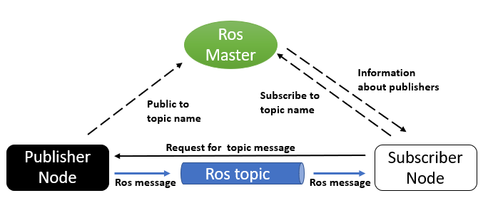

# **Introdução a ROS**

## **Índice**<!-- omit in toc -->
- [**O que é ROS?**](#O-que-é-ROS?)
    - [**O que é um framework**](#O-que-é-um-framework)
- [**Conceitos básicos**](#Conceitos-básicos)
    - [**Node**](#**Node**)
    - [**Package**](#**Package**)
    - [**Message**](#**Message**)
    - [**Topic**](#**Topic**)
    - [**Master**](#**Master**)
    - [**Esquema com os conceitos apresentados**](#Esquema-com-os-conceitos-apresentados)
- [**Exemplo na prática**](#Exemplo-na-prática)
- [**Referências**](#Referências)

## **O que é ROS?**

Imagine que você está construindo um robô e ele possui diferentes módulos, tais como câmeras, sensores, e eles precisam comunicar entre si. Aí você se pergunta: teria uma forma de facilitar essa comunicação? Bem, a resposta é sim, usando o ROS! 

O Robot Operating System (ROS) é um framework para desenvolvimento, reuso e compartilhamento de software no contexto de robótica. 

### **O que é um framework?**

Framework é um conjunto de bibliotecas e estruturas padronizadas que podem ser reutilizadas em diferentes processos. Ou seja, sua principal função é resolver os problemas frequentes, por meio de uma abordagem genérica. Dessa forma, o usuário pode focar no desenvolvimento de algo novo, não tendo que reinventar a roda.
Um exemplo disso é o uso do React, que fornece as funcionalidades e as estruturas para a programação de páginas web complexas, a partir de um conjunto de funcionalidades padrões que permitem a criação de projetos. Aliás, um framework pode ser feito a partir de uma coleção de padrões, APIs e até mesmo de bibliotecas.

Mas por que usar um framework?
Bem, eles permitem algumas vantagens, como:

- Redução na incidência de bugs;
- Padronização de códigos;
- Redução de custos operacionais;
- Maior consistência das aplicações.

Portanto, o ROS possui ferramentas, bibliotecas e convenções que visam simplificar a tarefa de criar robôs.

## **Conceitos básicos**

Para criar um robô com o ROS, diversos fatores devem ser levados em conta, como a comunicação dele com o código, as tarefas que ele deverá executar, entre outras coisas. Nesta parte serão explicados alguns conceitos essenciais do ROS. 

### **Node**

Menor unidade de processos executáveis, ou seja a unidade mínima de um projeto no ROS. Um node é um pedaço de código que realiza uma determinada tarefa. Cada node transmite e recebe informações por meio da message. Para saber mais detalhadamente sobre o que são nodes, dê uma olhada na Wiki oficial do ROS, disponível [**nesse link**](http://wiki.ros.org/Nodes).

### **Package**

Principal unidade de organização do software no ROS e é composto de um ou mais nodes, informações para execução dos nodes, entre outros. O package é a menor unidade de construção e lançamento do ROS. Para saber mais detalhadamente sobre o que são packages, dê uma olhada na Wiki oficial do ROS, disponível [**nesse link**](http://wiki.ros.org/Packages).

### **Message**

É a forma de comunicação entre os nodes. As messages possuem dados que fornecem informações para outros nodes. Um exemplo prático de *message* seria a leitura de um sensor de distância. Essas mensagens poderiam ser valores de distância, como 140 (cm), por exemplo. Dessa forma o sensor se comunica com os outros nodes.
Para saber mais detalhadamente sobre o que são messages, dê uma olhada na Wiki oficial do ROS, disponível [**nesse link**](http://wiki.ros.org/msg).

### **Topic**

Canal de comunicação entre nodes e identifica o conteúdo da message.

Quando um node está enviando dados, dizemos que está publicando um topic, ou seja, ele é o publisher. Já quando um node está recebendo dados, ele está assinando um topic, ou seja, ele é o subscriber. Vale dizer que os topics podem ter vários subscribers, mas somente um publisher.

Para saber mais detalhadamente sobre o que são topics, dê uma olhada na Wiki oficial do ROS, disponível [**nesse link**](http://wiki.ros.org/Topics).

### **Master**

Núcleo do ambiente em ROS e sabe o que está acontecendo em todo o sistema. É responsável por inicializar o sistema e fornecer o registro de nomes e o serviço de pesquisa para os nodes. Além disso, ela também configura as conexões entre os nodes.

### **Esquema com os conceitos apresentados**

Para melhor compreensão dos conceitos apresentados, o esquema abaixo mostra bem como acontece a comunicação no ROS.

O node subscriber solicita uma topic message para o node publisher. Esse, por sua vez, envia a message pedida p o subscriber. Isso tudo acontece pois a Master configura a conexão entre os nodes.

## **Exemplo na prática**

Aqui temos um exemplo que explica os conceitos apresentados. O node de processamento de imagem solicita a /image_data. Com isso, o node da câmera coleta os dados da câmera e envia a message (/image_data) para o node de processamento. Nesse caso, o Image Processing Node é o subscriber (pois está recebendo os dados) e o Camera Node é o publisher (pois está enviando a message). Além disso, a configuração entre esses nodes é realizada pela Master.

## **Referências**
- http://wiki.ros.org/ROS/Introduction
- http://wiki.ros.org/ROS/Concepts 