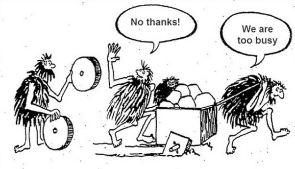
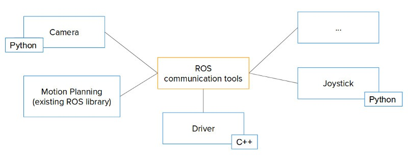
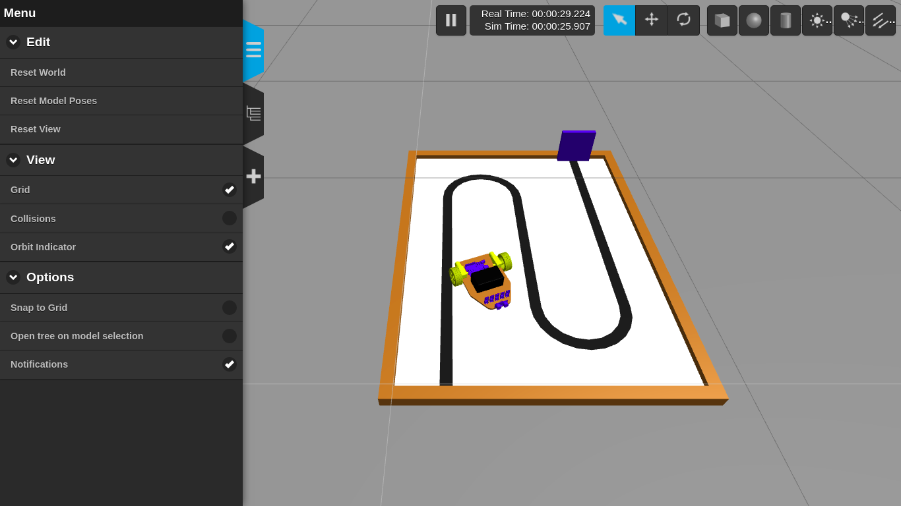

# Por que utilizar o ROS?

Agora que você já sabe o que é o ROS, é importante entender o porquê de utilizarmos ele em projetos de robótica. Esta ferramenta pode auxiliar no desenvolvimento de projetos e agilizar muitos trabalhos que, sem ela, teriam que ser feitos manualmente, além de proporcionar um ambiente *open-source* que auxilia desenvolvedores mais experientes. Para que possamos responder a pergunta "Por que utilizar o ROS" iremos explorar alguns benefícios que essa ferramenta pode nos proporcionar.

## Você não precisa reinventar a roda

Durante a criação de robôs muitas estruturas básicas podem ser reutilizadas, como controles, simuladores, entre outras coisas. Imagine que você faz parte de uma empresa que fabrica diversos tipos de robôs industriais, como robôs articulados, robôs cilíndricos, robôs cartesianos, entre outros. Nesta empresa, antes de iniciar a produção, é necessário simular o funcionamento desses robôs. A partir dessa necessidade, é possível concluir que muitos aspectos como a movimentação dos braços e a estrutura são similares.

{: .d-block .mx-auto}

O ROS é uma iniciativa que busca criar um “padrão” para os sistemas robóticos, com bibliotecas e ferramentas que podem ser reutilizadas em diversos tipos de projeto. Assim, o código do ROS pode ser utilizado para diversos tipos de robôs, permitindo que, ao invés de projetar um novo sistema para cada robô, seja possível reaproveitar diversos aspectos. Com isso, a produção e a simulação de sistemas robóticos se tornam muito mais fáceis, exigindo apenas o conhecimento de ROS e do funcionamento dos *nodes*.

Além disso, o tamanho da comunidade do ROS traz consigo a existência de uma grande diversidade de projetos, tornando possível a utilização de diversos pacotes externos durante o desenvolvimento de um projeto. Isso permite que o desenvolvedor não desperdice tempo com a criação de *joysticks*, sensores e outras funcionalidades, e se foque apenas na parte principal do projeto.

Para entender isso melhor, imagine que você vai desenvolver um robô de mineração lunar. Pense em todas as tarefas necessárias para fazer esse robô funcionar e enumere quantas dessas tarefas não estão diretamente ligadas à tarefa que realmente importa (mineração na Lua). Com o sistema de ROS, é possível se focar apenas nessa tarefa, uma vez que ele dispõe de pacotes externos que irão implementar tarefas como a movimentação, os sensores, entre outras coisas.

{: .d-block .mx-auto}

## Não depende de apenas uma linguagem de programação

Em muitos projetos, é possível que você se veja trabalhando com programadores que possuem conhecimentos diferentes dos seus. Imagine que você acaba de iniciar um projeto com um estudante de engenharia elétrica, que aprendeu C na matéria de introdução à computação, enquanto você aprendeu Python. O desenvolvimento desse projeto seria problemático sem uma ajuda externa.

Enquanto muitas ferramentas exigem que o desenvolvedor seja experiente em uma linguagem específica, com o ROS é possível construir *nodes* em diferentes linguagens de programação. Atualmente, o ROS tem suporte oficial para C++ e Python, porém, existem diversas bibliotecas que tornam possível a construção de *nodes* utilizando linguagens como RUST, NodeJS, entre outras. Com isso, a cooperação entre desenvolvedores é ampliada, permitindo que pessoas que têm conhecimento em linguagens diferentes possam trabalhar juntas no mesmo projeto, facilitando o desenvolvimento e a implementação de funcionalidades.

{: .d-block .mx-auto}

## Ferramentas de simulação

Além de promover diversos tipos de ferramentas para projetar um robô, o ROS também traz ferramentas de simulação, como o Gazebo. Com o uso dessas ferramentas, o ROS permite que o usuário simule seu projeto como se estivesse na vida real, adicionando constantes e propriedades físicas do ambiente e do robô, tornando o projeto similar ao da vida real. Com isso, a construção do projeto real será muito mais acurada e o desenvolvimento será muito mais fácil, uma vez que permite que testes visando melhorar o projeto sejam feitos.

{: .d-block .mx-auto}

___

ROS é definitivamente uma ferramenta poderosa no aprendizado de sistemas robóticos, capaz de ajudar você, futuro engenheiro mecatrônico, a desenvolver projetos inovadores com facilidade e rapidez. Aprender ROS é um grande passo para aprender a projetar sistemas robóticos. Quer aprender mais? Dê uma olhada nos sites abaixo:

- [Tutoriais da Wiki de ROS](http://wiki.ros.org/ROS/Tutorials)
- [Tutoriais do ConstructSim](https://www.theconstructsim.com/category/ros-tutorials)
- [Tutoriais do Gazebo](http://gazebosim.org/tutorials)
